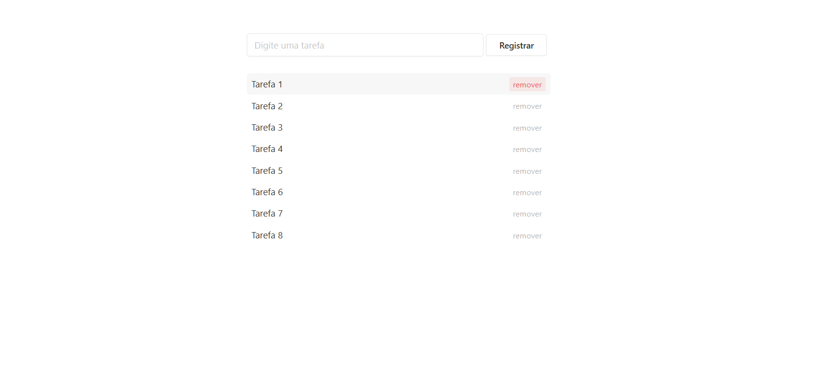

# 📝 ToDo List

Uma aplicação simples de lista de tarefas desenvolvida com **HTML**, **CSS** e **JavaScript**.  
Permite adicionar, remover e salvar tarefas diretamente no navegador utilizando **LocalStorage**.

---

## 📸 Demonstração



---

## 🚀 Funcionalidades

- **Adicionar tarefas**: insira uma tarefa no campo de texto e clique em "Registrar" ou pressione Enter.
- **Remover tarefas**: cada tarefa possui um link "remover" para excluí-la da lista.
- **Persistência de dados**: as tarefas são salvas no navegador usando LocalStorage, garantindo que não sejam perdidas ao recarregar a página.

---

## 🛠️ Tecnologias utilizadas

- **HTML5** para estrutura da aplicação  
- **CSS3** para estilização  
- **JavaScript** para lógica de interação e manipulação do DOM  
- **LocalStorage** para armazenamento dos dados

---

## 📂 Estrutura do projeto

```
📦 ToDo-List
 ┣ 📜 index.html
 ┣ 📜 style.css
 ┣ 📜 script.js
 ┗ 📸 todo.png
```

---

## ▶️ Como executar

1. Clone este repositório:
   ```bash
   git clone https://github.com/seuusuario/todo-list.git
   ```
2. Abra o arquivo `index.html` em qualquer navegador moderno.
3. Comece a adicionar suas tarefas!

---

## 💡 Melhorias futuras

- Editar tarefas diretamente na interface  
- Marcar tarefas concluídas  
- Filtro de tarefas (pendentes/concluídas)

---

## 📄 Licença

Este projeto está sob a licença MIT. Sinta-se livre para usar e modificar.